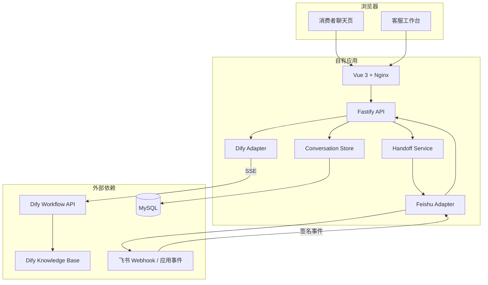
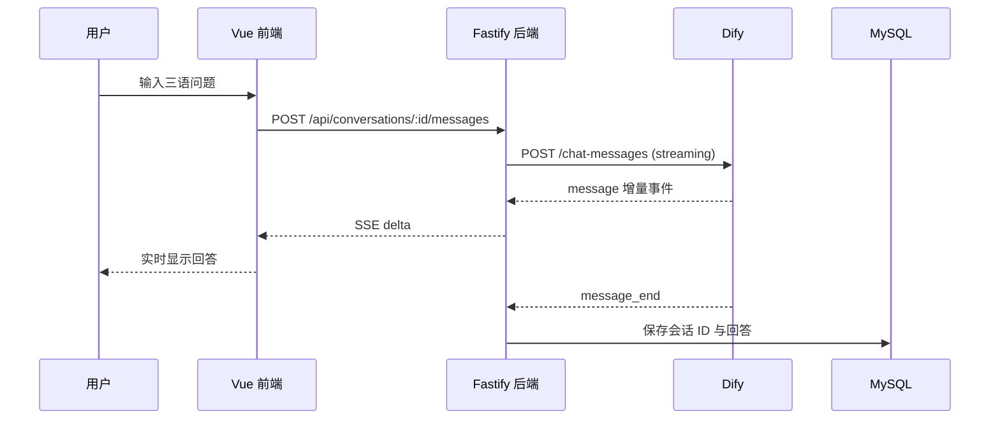
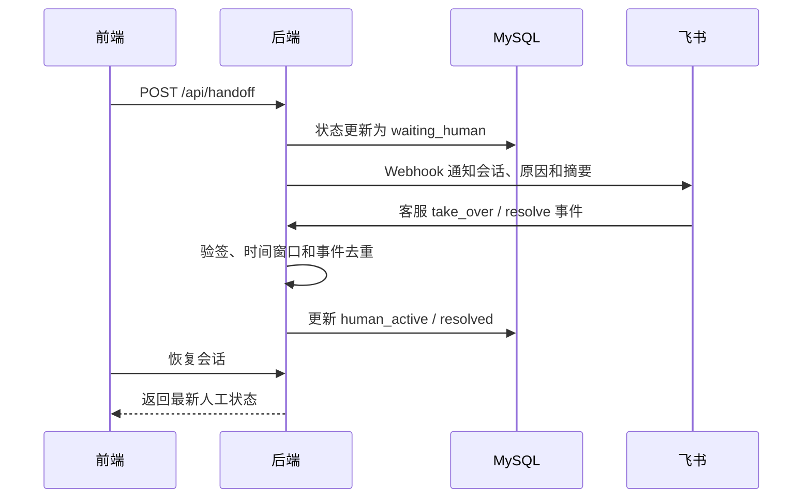

# 系统架构说明

## 1. 设计目标

系统将 Dify 的三语客服能力包装为可部署的全栈应用，同时解决以下工程问题：

- 浏览器不能直接接触 Dify API Key。
- 会话、语言和人工接管状态需要跨刷新恢复。
- Dify 的流式事件需要转换为前端可消费的稳定协议。
- 高风险售后和明确转人工请求需要进入人工协作链路。
- 飞书重复或伪造事件不能重复修改会话状态。

## 2. 组件关系

## 3. 真实回答链路

只要后端配置的是已发布 Dify 应用的真实 API Key，网页展示的就是 Dify 工作流和知识库实时生成的回答，不是前端 Mock 数据。

## 4. 人工接管链路

## 5. 数据模型

当前迁移包含三个核心表：

- `conversations`：用户、语言、Dify conversation ID、摘要和人工状态。
- `messages`：基于 `event_id` 幂等保存消息。
- `handoff_events`：人工转接原因、摘要和来源事件。

## 6. 安全边界

| 区域 | 可以获得的内容 | 不应获得的内容 |
|---|---|---|
| 浏览器 | 自有会话 API、流式回答、人工状态 | Dify API Key、数据库密码、飞书密钥 |
| Fastify 后端 | 服务端凭据、Dify 协议、MySQL、飞书协议 | 不向前端返回原始凭据 |
| Dify | 用户问题、用户标识、会话 ID | 数据库和飞书凭据 |
| 飞书 | 转接会话、原因和必要摘要 | Dify API Key、数据库连接信息 |

## 7. 当前实现边界

已经实现并由测试覆盖：

- Dify SSE 增量、结束和错误事件解析。
- 会话所有者校验和重复消息幂等。
- 飞书签名、过期请求和重放事件处理。
- 手动转人工状态更新与通知载荷。
- 前端生产构建和后端类型检查。

需要部署环境才能完成的验证：

- 已发布 Dify 应用的真实三语回答。
- 云 MySQL 的连接、备份和恢复。
- 飞书租户中的真实通知与客服接管。
- 公网域名、HTTPS、生产 CORS 和监控。

